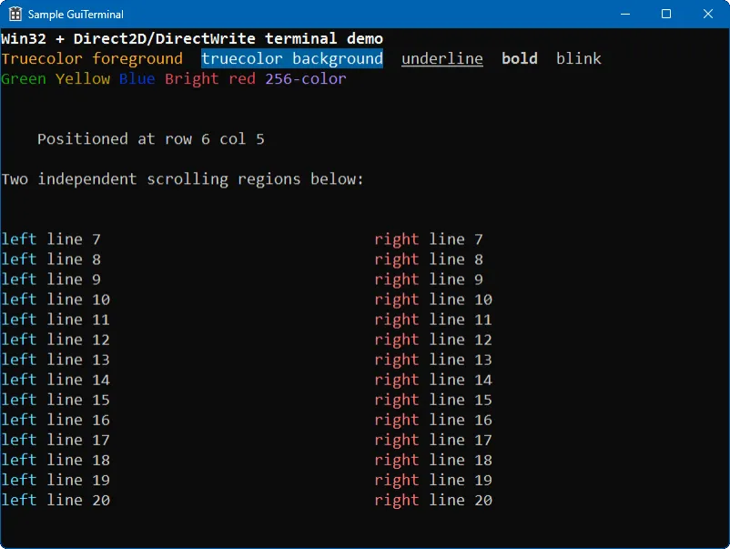

# GuiTerminal

GuiTerminal is a native C++ terminal control for Win32 desktop applications. It provides a custom terminal-like surface that can be embedded into your own windowed UI and rendered with Direct2D and DirectWrite.

The library is intended for applications that need terminal behavior without hosting an external console window. Typical use cases include embedded shells, device consoles, developer tools, log viewers, retro-style interfaces, and applications that want ANSI-style formatted text inside a standard Win32 GUI.



## Features

GuiTerminal gives you a reusable control that:

- Creates and manages a terminal surface inside a Win32 window.
- Maintains a character-cell buffer with per-cell foreground and background colors, and style attributes.
- Parses ANSI escape sequences for cursor movement, text styling, and color changes.
- Renders the terminal contents with Direct2D and DirectWrite.
- Supports writing to the full terminal or to sub-regions inside the terminal.
- Supports scrolling and region-based updates.

## Configure and build with CMake

```powershell
cmake -S . -B out -G "Visual Studio 18 2026" -A x64
cmake --build out --config Release
```

Here, `out` is only an example build directory name. You can replace it with any other directory, such as `build`, `build-release`, or `cmake-out`, as long as you use the same directory in both commands.
Additionally, you can choose another toolchain like `Visual Studio 17 2022`.

The first command configures the project and generates the build files inside that directory. The second command builds from that already-configured directory.

## vcpkg

The repository now includes an overlay port under [`vcpkg/ports/guiterminal`](c:/Fuentes/VSNet/Libraries/GuiTerminal/vcpkg/ports/guiterminal) so you can consume the library from source through `vcpkg` without depending on the old NuGet layout.

### Install from an overlay port

```powershell
vcpkg install guiterminal --overlay-ports=.\vcpkg\ports
```

Triplets control architecture, library linkage, and CRT linkage. Examples:

```powershell
vcpkg install guiterminal:x64-windows
vcpkg install guiterminal:x64-windows-static
vcpkg install guiterminal:x64-windows-static-md
```

The port builds the library from `src` and `include` through CMake and installs the exported `GuiTerminal::GuiTerminal` target.

Built-in Windows triplets cover these common cases:

- `x86-windows` / `x64-windows`: DLL + dynamic CRT
- `x86-windows-static`
- `x64-windows-static`
- `x86-windows-static-md`
- `x64-windows-static-md`

`vcpkg` handles `Debug` and `Release` automatically within the selected triplet, so you do not install separate debug and release packages manually.

If you need DLL + static CRT, define a custom triplet with:

```cmake
set(VCPKG_LIBRARY_LINKAGE dynamic)
set(VCPKG_CRT_LINKAGE static)
```

API surface depends on the selected linkage:

- Static-library triplets install both the existing C++ headers and the C wrapper header.
- Shared-library triplets install the C wrapper header only, because the DLL exports the C API and does not export the C++ classes.

When consuming the package from CMake with MSVC, your application CRT must also match the selected triplet. Set `CMAKE_MSVC_RUNTIME_LIBRARY` explicitly in the consumer project to match the triplet you selected for `vcpkg`.

For example, configure the consumer with one of these cache initializers before the first `project(...)` call:

```cmake
set(CMAKE_MSVC_RUNTIME_LIBRARY "MultiThreaded$<$<CONFIG:Debug>:Debug>")
```

```cmake
set(CMAKE_MSVC_RUNTIME_LIBRARY "MultiThreaded$<$<CONFIG:Debug>:Debug>DLL")
```

Use the first form for static-CRT triplets and the second form for dynamic-CRT triplets.

### Use the published registry

If you want to consume the package from the published registry at `https://github.com/mxmauro/vcpkg-registry`, add a `vcpkg-configuration.json` file to your consumer project:

```json
{
  "default-registry": {
    "kind": "builtin",
    "baseline": "<builtin-vcpkg-baseline>"
  },
  "registries": [
    {
      "kind": "git",
      "repository": "https://github.com/mxmauro/vcpkg-registry.git",
      "baseline": "<registry-commit-sha>",
      "packages": [
        "guiterminal"
      ]
    }
  ]
}
```

Then declare the dependency in your consumer `vcpkg.json`:

```json
{
  "name": "my-app",
  "version-string": "0.1.0",
  "dependencies": [
    "guiterminal"
  ]
}
```

And install with:

```powershell
vcpkg install --triplet x64-windows
```

Replace the triplet with the one that matches your project.

## Visual Studio projects

The existing Visual Studio projects are still present for local development. They now default to:

- `Debug`
- `Release`

Both use the static CRT and write outputs to the existing `lib/<platform>/<configuration>` and `bin/<project>/<platform>/<configuration>` folders.

## LICENSE

[MIT](/LICENSE)
